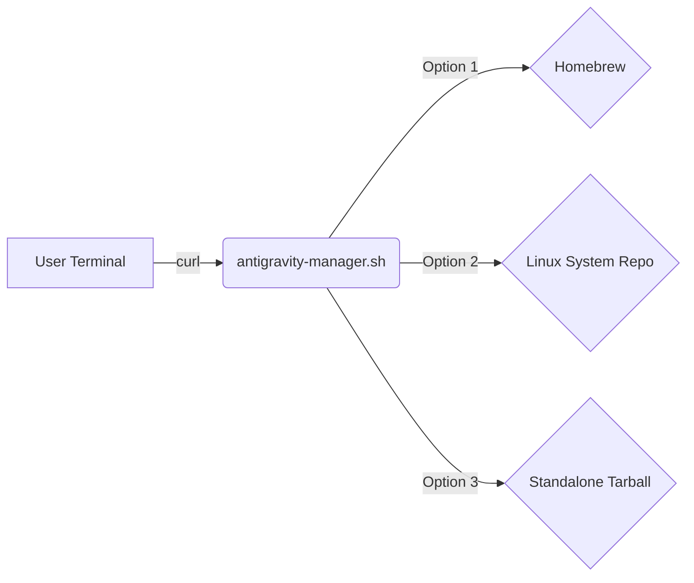

# Google Antigravity Easy Install

[](https://github.com/wtg-codes/agv-easy-install/actions/workflows/nightly-update.yml)

A cross-platform installation script for Google Antigravity.

## 🚀 Quick Install (Recommended)

The easiest way to get started is to follow our **[Interactive Installation Guide](https://wtg-codes.github.io/agv-easy-install/)**.

Alternatively, run this command in your terminal:

```bash
curl -fSsL "https://raw.githubusercontent.com/wtg-codes/agv-easy-install/main/antigravity-manager.sh" | bash
```

### Homebrew Users (macOS/Linux)
If you prefer Homebrew, you can just run the script and select Option 1, or install directly if the formula is available:
```bash
brew install --cask antigravity
```

## 🏗️ Architecture



## 💻 Supported Platforms

| Platform | Recommended Method | Fallback |
|----------|-------------------|----------|
| macOS | Homebrew | None |
| Ubuntu/Debian | APT | Tarball |
| Fedora/RHEL | DNF | Tarball |
| Other Linux | Tarball | Tarball |

### Manual Tarball Download
If you prefer to download the tarball directly without using the installer:
```bash
# TARBALL_URL — kept in sync by the nightly CI workflow
curl -fSsL "https://edgedl.me.gvt1.com/edgedl/release2/j0qc3/antigravity/stable/1.23.2-4781536860569600/linux-x64/Antigravity.tar.gz" -o Antigravity.tar.gz
```
> **Note:** This URL is updated nightly by CI. If the download fails, run the installer script instead — it always has the latest link.

## 🛠️ Troubleshooting
If you encounter `curl: (23) Failed writing body`, it usually means you need to update `curl` or try downloading the file manually.
If `antigravity` is not found after install, try reopening your terminal or running `source ~/.bashrc`.

## 🗺️ Roadmap
- [x] Phase 1: Basic setup and repo structure
- [x] Phase 2: Shell script hardening and Homebrew support
- [x] Phase 3: CI/CD fixes for nightly updates
- [x] Phase 4: Documentation polish
- [ ] Future: Windows support (Winget/Chocolatey)

## 📝 Changelog
See [CHANGELOG.md](CHANGELOG.md) for detailed history or check git commit logs.

## 📁 Locations
- **Application:** `~/.local/lib/antigravity`
- **Binary:** `~/.local/bin/antigravity`
- **Manager:** `~/.local/bin/antigravity-manager`
- **Workspace:** `~/my-antigravity-work`
