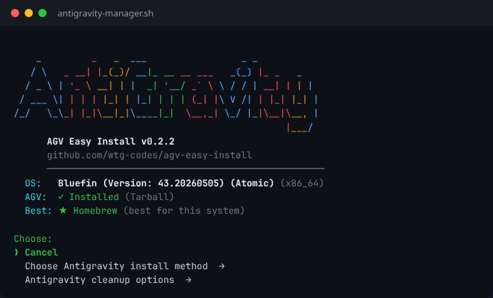
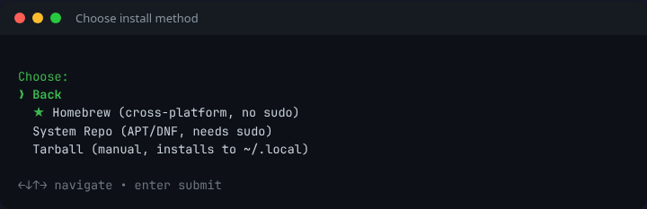
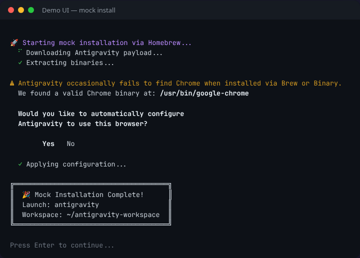
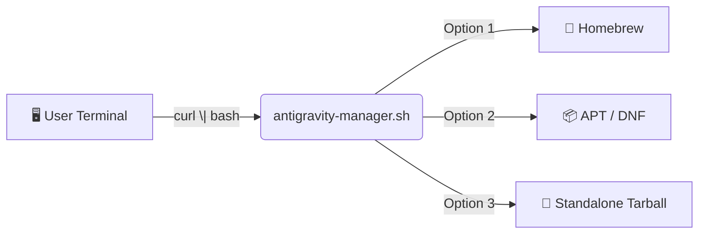

<p align="center">
  
  <a href="https://github.com/wtg-codes/agv-easy-install/actions/workflows/nightly-update.yml"></a>
  <a href="LICENSE"></a>
</p>

# 🚀 AGV Easy Install

> **Unofficial Google Antigravity setup by [wtg-codes](https://github.com/wtg-codes).**
> One command. Any shell. We get you coding.

<p align="center">
  
</p>

---

## ⚡ Quick Start

**Option A — Interactive Guide (recommended for students)**

👉 **[Open the Interactive Installation Guide](https://wtg-codes.github.io/agv-easy-install/)**

**Option B — Direct install**

```bash
curl -fSsL "https://raw.githubusercontent.com/wtg-codes/agv-easy-install/main/antigravity-manager.sh" | bash
```

**Option C — Advanced (Headless / Automation)**

The script supports non-interactive execution for CI/CD and provisioning tools:
```bash
# Auto-detect and install without prompts
curl -fSsL "https://raw.githubusercontent.com/wtg-codes/agv-easy-install/main/antigravity-manager.sh" | bash -s -- --auto

# Or force a specific method
bash antigravity-manager.sh --install-brew
bash antigravity-manager.sh --install-repo
bash antigravity-manager.sh --install-tarball

# Additional options
bash antigravity-manager.sh --verbose  # Print detailed logs
bash antigravity-manager.sh --quiet    # Suppress non-error output
bash antigravity-manager.sh --remove   # Uninstall
bash antigravity-manager.sh --json     # Output single JSON object on completion
bash antigravity-manager.sh --demo-ui  # Sandbox mode — test the UI without installing
```

---

## 🖥️ What You'll See

The installer uses a hierarchical menu system — pick a category, then choose your method.

**1. Choose your install method →** The ★ marks the recommended option for your system.

<p align="center">
  
</p>

**2. Cleanup options →** Uninstall, manage the script, or try Demo UI mode.

<p align="center">
  
</p>

**3. Demo UI (sandbox mode)** — Test the full installation experience without changing your system.

<p align="center">
  
</p>

---

## 🏗️ Architecture



The installer detects your OS and package manager, then recommends the best method automatically.

---

## 💻 Supported Platforms

| Platform | Status | Method | Notes |
|---|---|---|---|
| **Ubuntu / Debian / Mint / Kali** | ✅ Tested | APT or Tarball | Primary development target |
| **Fedora / RHEL / CentOS** | ✅ Tested | DNF or Tarball | Auto-updates via system repo |
| **Bluefin / Silverblue / Atomic Linux** | ✅ Tested | Homebrew or Tarball | Avoids layering; primary dev machine |
| **macOS** | ⚠️ Beta | Homebrew | Script runs but not fully validated — see [Roadmap](#-roadmap) |
| **Crostini (ChromeOS)** | ⚠️ Beta | APT / Tarball | Debian container; Chrome host detection |
| **Windows (WSL)** | ⚠️ Beta | Tarball / APT | WSL2 Ubuntu; GUI shortcuts skipped |
| **Windows (Git Bash)** | ❌ Blocked | — | Redirects user to WSL2 |

<details>
<summary>📥 Manual tarball download (Linux only)</summary>

```bash
# This URL is updated nightly by CI
curl -fSsL "https://edgedl.me.gvt1.com/edgedl/release2/j0qc3/antigravity/stable/1.23.2-4781536860569600/linux-x64/Antigravity.tar.gz" \
  -o Antigravity.tar.gz
```

> If this URL fails, run the installer script instead — it always has the latest link.

</details>

---

## 📁 Install Locations (Tarball)

| Item | Path |
|---|---|
| Application | `~/.local/lib/antigravity` |
| Binary | `~/.local/bin/antigravity` |
| Manager | `~/.local/bin/antigravity-manager` |
| Workspace | `~/my-antigravity-work` |

---

## 🛠️ Troubleshooting

| Problem | Fix |
|---|---|
| `curl: (23) Failed writing body` | Update `curl`, or download the tarball manually |
| `antigravity: command not found` | Close and reopen your terminal, or run `source ~/.bashrc` (Linux) / `source ~/.zprofile` (macOS) |
| Homebrew formula not found | Run the installer and choose Tarball instead |
| macOS: `gum` fails to download | Ensure `curl` works and you have internet. The script falls back to a plain text menu. |
| macOS: `.desktop` file error | Expected — `.desktop` files are Linux-only. The script should skip this on macOS. File an issue if it doesn't. |

---

## 🗺️ Roadmap

> **Philosophy:** If you can get to a shell and paste a command, we help you install.
> The bash script **is** the cross-platform tool — each new OS adds a detection path.

### ✅ Done

| Feature | Notes |
|---|---|
| Linux APT / DNF install | Ubuntu, Debian, Fedora, RHEL |
| Standalone tarball install | Any Linux with glibc ≥ 2.28 |
| Homebrew install path | Linux + macOS (code exists) |
| SHA-256 integrity checks | Verifies tarball before extraction |
| Hierarchical gum TUI | Cancel-first, sub-menus, sandbox mode |
| Auto-detection + recommendation | OS, package manager, existing install |
| Windows / WSL2 detection | Detects MSYS2 (hard block), guides to WSL2 |
| ChromeOS / Crostini detection | Detects milestone, garcon, auto-suggests APT |

### ⚠️ In Progress — macOS

| Task | Status |
|---|---|
| `gum` bootstrap on macOS (arm64 + x86_64) | 🔍 Needs testing |
| Skip `.desktop` file creation on Darwin | ✅ Done |
| `open` vs `xdg-open` for easter egg | ✅ Done |
| `shasum -a 256` fallback for tarball verification | ✅ Done |
| PATH setup for `~/.zprofile` vs `~/.bashrc` | ✅ Done |
| Tarball fallback with Gatekeeper `xattr` warning | ✅ Done |
| Homebrew formula actually installs Antigravity on macOS | 🔍 Needs testing |
| End-to-end test on macOS Sonoma / Sequoia | ❌ Not yet done |

### 📋 Planned

| Feature | Notes |
|---|---|
| Official binary installers (macOS / Windows) | Scrape official release site for platform-specific binaries |
| macOS `.dmg` download fallback | For users without Homebrew |
| CI gate tests on macOS | ✅ Done — `ci.yml` runs on `macos-latest` |

---

## 📝 Changelog

See **[CHANGELOG.md](CHANGELOG.md)** for release history.

---

## 🤝 Contributing

See **[CONTRIBUTING.md](CONTRIBUTING.md)** for guidelines.
All changes must pass `bash tests/run_gates.sh --phase all` before merging.

---

<p align="center">
  <sub>MIT License · Made for students · <a href="https://wtg-codes.github.io/agv-easy-install/">Interactive Guide</a></sub>
</p>
