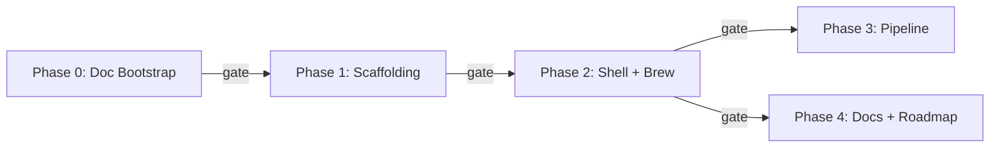

# Fix Up `agv-easy-install` — Implementation Plan

Based on the findings from the [critique](critique.md) and [retort](retort.md), plus the goal of adding **Homebrew support** and laying groundwork for future cross-OS compatibility.

**5 phases (0–4)**, each with individually testable steps, explicit exit criteria, and gate tests that must pass before moving to the next phase.

---

## Test-Driven Framework

Every step has a **Test** column — a concrete command that returns 0 on success. Every phase ends with a **Phase Gate** — a combined checklist that must fully pass before the next phase begins.

A master gate-runner script (`tests/run_gates.sh`) will be created in Phase 0 to automate this.

```
Phase 0 ──gate──▶ Phase 1 ──gate──▶ Phase 2 ──gate──▶ Phase 3 ──gate──▶ Phase 4 ──gate──▶ Done
```

---

## Phase 0 — Documentation Bootstrap
**PR Title:** `docs: add architecture critique, retort, and implementation plan to repo`

> Puts the planning artifacts into the repo so they're versioned, reviewable, and discoverable.

### Steps

| # | Task | Test |
|---|------|------|
| 0.1 | Create `docs/architecture/` directory | `test -d docs/architecture` |
| 0.2 | Copy `critique.md` into `docs/architecture/` | `test -s docs/architecture/critique.md` |
| 0.3 | Copy `retort.md` into `docs/architecture/` | `test -s docs/architecture/retort.md` |
| 0.4 | Create `implementation_plan.md` in `docs/architecture/` | `test -s docs/architecture/implementation_plan.md` |
| 0.5 | Create `tests/` directory | `test -d tests` |
| 0.6 | Create `tests/run_gates.sh` — master gate runner with all phase gate functions | `bash tests/run_gates.sh --phase 0` exits 0 |

### Phase 0 Gate

```bash
gate_0() {
    echo "=== Phase 0 Gate ==="
    test -s docs/architecture/critique.md            && echo "✅ 0.G1 critique.md"
    test -s docs/architecture/retort.md              && echo "✅ 0.G2 retort.md"
    test -s docs/architecture/implementation_plan.md && echo "✅ 0.G3 implementation_plan.md"
    test -x tests/run_gates.sh                       && echo "✅ 0.G4 run_gates.sh executable"
    echo "=== Phase 0 PASSED ==="
}
```

### Files Touched
| Action | File |
|--------|------|
| NEW | `docs/architecture/critique.md` |
| NEW | `docs/architecture/retort.md` |
| NEW | `docs/architecture/implementation_plan.md` |
| NEW | `tests/run_gates.sh` |

---

## Phase 1 — Project Scaffolding & Hygiene
**PR Title:** `chore: add LICENSE, .gitignore, requirements.txt, CONTRIBUTING, and scope Pages deploy`
**Depends on:** Phase 0 gate

> Foundation work. No behavior changes to the installer.

### Steps

| # | Task | Test |
|---|------|------|
| 1.1 | Create `LICENSE` (MIT, current year, wtg-codes) | `head -1 LICENSE \| grep -qi "MIT"` |
| 1.2 | Create `.gitignore` (Python, OS, editor patterns) | `grep -q "__pycache__" .gitignore && grep -q ".DS_Store" .gitignore` |
| 1.3 | Create `requirements.txt` (pin `requests>=2.31,<3`) | `grep -q "requests" requirements.txt` |
| 1.4 | Create `CONTRIBUTING.md` — how to fork, branch, test, and PR | `test -s CONTRIBUTING.md` |
| 1.5 | Create `.github/PULL_REQUEST_TEMPLATE.md` — checklist for PRs | `test -s .github/PULL_REQUEST_TEMPLATE.md` |
| 1.6 | Move `index.html` → `docs/index.html` | `test -f docs/index.html && ! test -f index.html` |
| 1.7 | Update `deploy-pages.yml`: `path: '.'` → `path: 'docs'` | `grep -q "path: 'docs'" .github/workflows/deploy-pages.yml` |
| 1.8 | Pin all action versions in `deploy-pages.yml` to `@v4` | `! grep -E "uses:.*@v[0-3]$" .github/workflows/deploy-pages.yml` |

### Phase 1 Gate

```bash
gate_1() {
    echo "=== Phase 1 Gate ==="
    head -1 LICENSE | grep -qi "MIT"                       && echo "✅ 1.G1  LICENSE is MIT"
    grep -q "__pycache__" .gitignore                       && echo "✅ 1.G2  .gitignore has __pycache__"
    grep -q ".DS_Store" .gitignore                         && echo "✅ 1.G3  .gitignore has .DS_Store"
    grep -q "requests" requirements.txt                    && echo "✅ 1.G4  requirements.txt pins requests"
    test -s CONTRIBUTING.md                                && echo "✅ 1.G5  CONTRIBUTING.md exists"
    test -s .github/PULL_REQUEST_TEMPLATE.md               && echo "✅ 1.G6  PR template exists"
    test -f docs/index.html                                && echo "✅ 1.G7  docs/index.html exists"
    ! test -f index.html                                   && echo "✅ 1.G8  root index.html removed"
    grep -q "path: 'docs'" .github/workflows/deploy-pages.yml && echo "✅ 1.G9  Pages scoped to docs/"
    echo "=== Phase 1 PASSED ==="
}
```

### Files Touched
| Action | File |
|--------|------|
| NEW | `LICENSE` |
| NEW | `.gitignore` |
| NEW | `requirements.txt` |
| NEW | `CONTRIBUTING.md` |
| NEW | `.github/PULL_REQUEST_TEMPLATE.md` |
| MOVE | `index.html` → `docs/index.html` |
| MODIFY | `.github/workflows/deploy-pages.yml` |

---

## Phase 2 — Shell Script Hardening + Homebrew Support
**PR Title:** `feat: harden script, add Homebrew install path, and UX flags`
**Depends on:** Phase 1 gate

> Hardens the existing script, adds Homebrew as a first-class install method, improves the CLI interface.

### Steps — Safety & Correctness

| # | Task | Test |
|---|------|------|
| 2.1 | Add `SCRIPT_VERSION="1.1.0"` constant at top | `grep -q 'SCRIPT_VERSION=' antigravity-manager.sh` |
| 2.2 | Quote all variable expansions | `shellcheck -e SC1091,SC2162 antigravity-manager.sh 2>&1 \| grep -c "SC2086"` returns `0` |
| 2.3 | Switch all curl calls to `-fSsL` | `! grep 'curl ' antigravity-manager.sh \| grep -v '\-f' \| grep -qv '^#'` |
| 2.4 | Add `trap 'rm -rf "$TMP_DIR"' EXIT` in `do_install_tarball()` | `grep -q "trap.*TMP_DIR.*EXIT" antigravity-manager.sh` |
| 2.5 | Add SHA-256 checksum verification after tarball download (`KNOWN_SHA256` constant + `sha256sum -c`) | `grep -q "sha256sum" antigravity-manager.sh && grep -q "KNOWN_SHA256" antigravity-manager.sh` |
| 2.6 | Fix `$0` pipe detection — replace `*"bash"*` with `[ -f "$0" ] && [ -r "$0" ]` | `! grep -q '"bash"' antigravity-manager.sh` |
| 2.7 | Add `gpgcheck=0` explanation comment in RPM repo block | `grep -B2 "gpgcheck=0" antigravity-manager.sh \| grep -qi "artifact registry\|upstream\|signing"` |

### Steps — Homebrew Install Path

| # | Task | Test |
|---|------|------|
| 2.8 | Add `detect_platform()` function (`uname -s` → sets `PLATFORM`) | `grep -q "detect_platform" antigravity-manager.sh` |
| 2.9 | Add `check_brew()` helper (is `brew` in PATH?) | `grep -q "check_brew" antigravity-manager.sh` |
| 2.10 | Add `install_brew()` function — `brew install --cask antigravity` (macOS) / `brew install antigravity` (Linux). **Must handle "formula not found" gracefully** with fallback suggestion to tarball | `grep -q "install_brew" antigravity-manager.sh` |
| 2.11 | Add brew removal path in `do_remove()` | `grep -q "brew.*uninstall\|brew.*remove" antigravity-manager.sh` |
| 2.12 | Update interactive menu to 7 options (Brew = Option 2, renumber rest) | `grep -q '\[1-7\]' antigravity-manager.sh` |
| 2.13 | Add platform auto-detection suggestion in menu header (e.g., "Detected: macOS — we recommend Option 2") | `grep -q "Detected\|Recommended\|recommend" antigravity-manager.sh` |

### Steps — UX & Platform Awareness

| # | Task | Test |
|---|------|------|
| 2.14 | Add `--version` flag | `bash antigravity-manager.sh --version 2>&1 \| grep -q "1.1.0"` |
| 2.15 | Expand `--help` to document all flags | `bash antigravity-manager.sh --help 2>&1 \| grep -q "\-\-version"` |
| 2.16 | Add `sudo` privilege warning before repo install (Option 1) | `grep -qi "require.*privilege\|require.*sudo\|require.*admin" antigravity-manager.sh` |
| 2.17 | macOS-aware paths: skip `.desktop` file creation; use `open` instead of `xdg-open`; use `xdg-user-dir DESKTOP` on Linux with fallback to `$HOME/Desktop` | `grep -q "xdg-user-dir\|uname.*Darwin" antigravity-manager.sh` |
| 2.18 | Easter egg: use `open` on macOS instead of `xdg-open` (same logic as 2.17) | `grep -q "open.*course-catalog" antigravity-manager.sh` |

### Phase 2 Gate

```bash
gate_2() {
    echo "=== Phase 2 Gate ==="
    bash -n antigravity-manager.sh                         && echo "✅ 2.G1  Syntax valid"
    shellcheck -e SC1091,SC2162 antigravity-manager.sh     && echo "✅ 2.G2  Shellcheck clean"
    bash antigravity-manager.sh --version 2>&1 | grep -q "1.1.0" \
                                                           && echo "✅ 2.G3  --version works"
    bash antigravity-manager.sh --help 2>&1 | grep -q "\-\-version" \
                                                           && echo "✅ 2.G4  --help lists --version"
    bash antigravity-manager.sh --help 2>&1 | grep -q "\-\-remove" \
                                                           && echo "✅ 2.G5  --help lists --remove"
    grep -q "detect_platform" antigravity-manager.sh       && echo "✅ 2.G6  detect_platform()"
    grep -q "install_brew" antigravity-manager.sh          && echo "✅ 2.G7  install_brew()"
    grep -q "check_brew" antigravity-manager.sh            && echo "✅ 2.G8  check_brew()"
    grep -q "trap.*EXIT" antigravity-manager.sh            && echo "✅ 2.G9  trap cleanup"
    grep -q "sha256sum" antigravity-manager.sh             && echo "✅ 2.G10 SHA-256 check"
    grep -q "KNOWN_SHA256" antigravity-manager.sh          && echo "✅ 2.G11 KNOWN_SHA256 constant"
    ! grep -q '"bash"' antigravity-manager.sh              && echo "✅ 2.G12 Old \$0 detection removed"
    grep -q '\[1-7\]' antigravity-manager.sh               && echo "✅ 2.G13 Menu has 7 options"
    grep -q "Detected\|Recommended\|recommend" antigravity-manager.sh \
                                                           && echo "✅ 2.G14 Auto-detect suggestion"
    echo "=== Phase 2 PASSED ==="
}
```

### Files Touched
| Action | File |
|--------|------|
| MODIFY | `antigravity-manager.sh` |

---

## Phase 3 — Nightly Pipeline Fixes
**PR Title:** `ci: harden nightly update — validation, shellcheck, checksum sync, and safe sed`
**Depends on:** Phase 1 gate (needs `requirements.txt`) + Phase 2 gate (needs shellcheck-clean script + `KNOWN_SHA256` constant)

> [!CAUTION]
> **Critical gap found:** Phase 2 adds `KNOWN_SHA256` checksum verification to the script. If the nightly workflow updates the download URL but *doesn't also update the hash*, the tarball install will reject every download after the first nightly run. The nightly workflow **must** download the new tarball, compute its SHA-256, and update both `DOWNLOAD_URL` and `KNOWN_SHA256` in the script.

### Steps — Workflow

| # | Task | Test |
|---|------|------|
| 3.1 | Pin `actions/checkout` to `@v4` | `grep -q "actions/checkout@v4" .github/workflows/nightly-update.yml` |
| 3.2 | Pin `actions/setup-python` to `@v5` | `grep -q "actions/setup-python@v5" .github/workflows/nightly-update.yml` |
| 3.3 | Replace `pip install requests` with `pip install -r requirements.txt` | `grep -q "requirements.txt" .github/workflows/nightly-update.yml` |
| 3.4 | Add URL validation step — `curl -fSsL --head "$LATEST_URL"` returns 200 before proceeding | `grep -qE "curl.*(--head\|-I)" .github/workflows/nightly-update.yml` |
| 3.5 | Change `sed` delimiter from `\|` to `#` | `grep "sed" .github/workflows/nightly-update.yml \| grep -q "#"` |
| 3.6 | Add `shellcheck` lint step after `sed` modification, before commit | `grep -q "shellcheck" .github/workflows/nightly-update.yml` |
| 3.7 | **Add SHA-256 sync step** — download the new tarball, compute `sha256sum`, and update `KNOWN_SHA256` in the script alongside `DOWNLOAD_URL` | `grep -q "KNOWN_SHA256" .github/workflows/nightly-update.yml` |
| 3.8 | Improve commit message — include old → new URL for auditability | `grep -q "old\|previous\|from.*to" .github/workflows/nightly-update.yml` |

### Steps — Scraper

| # | Task | Test |
|---|------|------|
| 3.9 | Add module docstring explaining the scraping strategy | `python3 -c "import ast; m=ast.parse(open('scrape_latest.py').read()); assert ast.get_docstring(m)"` |
| 3.10 | Add type hints to `scrape_url()` | `grep -q "def scrape_url.*->.*:" scrape_latest.py` |
| 3.11 | Add URL validation — HEAD request before printing | `grep -qi "head" scrape_latest.py` |
| 3.12 | Print errors to stderr (`file=sys.stderr`) | `grep -q "stderr" scrape_latest.py` |
| 3.13 | Verify syntax | `python3 -m py_compile scrape_latest.py` |

### Phase 3 Gate

```bash
gate_3() {
    echo "=== Phase 3 Gate ==="
    NIGHTLY=".github/workflows/nightly-update.yml"

    grep -q "actions/checkout@v4" "$NIGHTLY"              && echo "✅ 3.G1  checkout@v4"
    grep -q "actions/setup-python@v5" "$NIGHTLY"          && echo "✅ 3.G2  setup-python@v5"
    grep -q "requirements.txt" "$NIGHTLY"                 && echo "✅ 3.G3  requirements.txt used"
    grep -qE "curl.*(--head|-I)" "$NIGHTLY"               && echo "✅ 3.G4  URL validation step"
    grep -q "shellcheck" "$NIGHTLY"                       && echo "✅ 3.G5  shellcheck lint step"
    grep "sed" "$NIGHTLY" | grep -q "#"                   && echo "✅ 3.G6  sed safe delimiter"
    grep -q "KNOWN_SHA256" "$NIGHTLY"                     && echo "✅ 3.G7  SHA-256 sync step"

    python3 -m py_compile scrape_latest.py                && echo "✅ 3.G8  scraper compiles"
    python3 -c "
import ast; m=ast.parse(open('scrape_latest.py').read())
assert ast.get_docstring(m)
"                                                         && echo "✅ 3.G9  scraper has docstring"
    grep -q "def scrape_url.*->.*:" scrape_latest.py      && echo "✅ 3.G10 scraper has type hints"
    grep -q "stderr" scrape_latest.py                     && echo "✅ 3.G11 errors to stderr"

    echo "=== Phase 3 PASSED ==="
}
```

### Files Touched
| Action | File |
|--------|------|
| MODIFY | `.github/workflows/nightly-update.yml` |
| MODIFY | `scrape_latest.py` |

---

## Phase 4 — Landing Page, README, & Roadmap Polish
**PR Title:** `docs: SEO, accessibility, Homebrew docs, README overhaul, and roadmap`
**Depends on:** Phase 2 gate (needs Homebrew option to document)

> Final polish. No behavior changes to the installer.

### Steps — Landing Page

| # | Task | Test |
|---|------|------|
| 4.1 | Pin Lucide to specific version (not `@latest`) | `! grep -q "lucide@latest" docs/index.html` |
| 4.2 | Add `<meta name="description">` | `grep -q 'meta name="description"' docs/index.html` |
| 4.3 | Add Open Graph tags (`og:title`, `og:description`) | `grep -q 'og:title' docs/index.html` |
| 4.4 | Add favicon (`<link rel="icon">`) | `grep -q 'rel="icon"' docs/index.html` |
| 4.5 | Add `aria-label` to copy button and Export PDF button | `grep -c 'aria-label' docs/index.html` returns ≥ 2 |
| 4.6 | Add `aria-expanded` JS toggle on `<details>` | `grep -q 'aria-expanded' docs/index.html` |
| 4.7 | Add XSS safety comment on `textContent` line | `grep -q 'SECURITY.*textContent' docs/index.html` |
| 4.8 | Add Homebrew to menu options explained section (new Option 2 card) | `grep -qi 'homebrew\|brew' docs/index.html` |
| 4.9 | Update option numbers in the menu explanation to match the new 7-option layout | `grep -q 'Option.*7\|option.*7\|\[1-7\]' docs/index.html` |

### Steps — README

| # | Task | Test |
|---|------|------|
| 4.10 | Add CI status badge at the top | `head -5 README.md \| grep -q 'badge\|shields\|workflow'` |
| 4.11 | Add architecture section with Mermaid diagram | `grep -qi 'architecture' README.md` |
| 4.12 | Expand supported platforms — table with APT, DNF, Homebrew, Tarball | `grep -qi 'homebrew\|brew' README.md` |
| 4.13 | Add Homebrew quick-install one-liner | `grep -q 'brew install' README.md` |
| 4.14 | Add troubleshooting section | `grep -qi 'troubleshooting' README.md` |
| 4.15 | Add roadmap section with philosophy and milestone table | `grep -qi 'roadmap' README.md` |
| 4.16 | Fix "exclusively on Ubuntu/Linux" scope claim | `! grep -qi "exclusively on Ubuntu" README.md` |
| 4.17 | Add changelog link or CHANGELOG.md | `grep -qi 'changelog' README.md` |

### Phase 4 Gate

```bash
gate_4() {
    echo "=== Phase 4 Gate ==="
    # Landing page
    ! grep -q "lucide@latest" docs/index.html              && echo "✅ 4.G1  Lucide pinned"
    grep -q 'meta name="description"' docs/index.html      && echo "✅ 4.G2  Meta description"
    grep -q 'og:title' docs/index.html                     && echo "✅ 4.G3  OG tags"
    grep -q 'rel="icon"' docs/index.html                   && echo "✅ 4.G4  Favicon"
    [ "$(grep -c 'aria-label' docs/index.html)" -ge 2 ]    && echo "✅ 4.G5  Aria labels (≥2)"
    grep -qi 'brew' docs/index.html                        && echo "✅ 4.G6  Homebrew in landing page"
    grep -q 'aria-expanded' docs/index.html                && echo "✅ 4.G7  aria-expanded toggle"

    # README
    grep -qi 'architecture' README.md                      && echo "✅ 4.G8  Architecture section"
    grep -qi 'brew' README.md                              && echo "✅ 4.G9  Homebrew documented"
    grep -qi 'troubleshooting' README.md                   && echo "✅ 4.G10 Troubleshooting"
    grep -qi 'roadmap' README.md                           && echo "✅ 4.G11 Roadmap"
    ! grep -qi "exclusively on Ubuntu" README.md           && echo "✅ 4.G12 Scope claim fixed"
    grep -qi 'changelog' README.md                         && echo "✅ 4.G13 Changelog"

    echo "=== Phase 4 PASSED ==="
}
```

### Files Touched
| Action | File |
|--------|------|
| MODIFY | `docs/index.html` |
| MODIFY | `README.md` |

---

## Dependency Graph



> **Execution order:** P0 → P1 → P2 → P3 → P4 (serialized for simplicity)

---

## Master Gate Runner (`tests/run_gates.sh`)

A single executable script containing all gate functions. Usage:

```bash
bash tests/run_gates.sh --phase 0     # Run one phase gate
bash tests/run_gates.sh --phase all   # Run all phase gates sequentially
```

Each `gate_N()` function is the exact bash code shown in the gate blocks above. The runner:
1. Sources all gate functions
2. Runs the requested gate(s)
3. Exits non-zero on first failure (`set -e`)
4. Prints a summary at the end

---

## Summary

| Phase | PR Title | Steps | Gate Tests | Depends On |
|-------|----------|-------|------------|------------|
| 0 | `docs: architecture docs + test framework` | 6 | 4 | — |
| 1 | `chore: scaffolding + hygiene` | 8 | 9 | Phase 0 |
| 2 | `feat: shell hardening + Homebrew` | 18 | 14 | Phase 1 |
| 3 | `ci: pipeline hardening + SHA sync` | 13 | 11 | Phase 1+2 |
| 4 | `docs: SEO, a11y, README overhaul` | 17 | 13 | Phase 2 |
| **Total** | | **62** | **51** | |

---

## Gaps Identified (Previously Missing)

> [!IMPORTANT]
> These items were missing from earlier versions of the plan and have now been incorporated:

| Gap | Severity | Where Fixed |
|-----|----------|-------------|
| **Nightly must update `KNOWN_SHA256` alongside the URL** — otherwise checksum verification breaks on every nightly run | 🔴 Critical | Phase 3, step 3.7 |
| **Homebrew formula may not exist yet** — `install_brew()` must handle "formula not found" gracefully | 🟡 Medium | Phase 2, step 2.10 (note) |
| **macOS-aware paths** — skip `.desktop`, use `open` not `xdg-open`, skip `xdg-user-dir` | 🟡 Medium | Phase 2, step 2.17 |
| **Auto-detect platform suggestion** in menu | 🟢 Low | Phase 2, step 2.13 |
| **Easter egg macOS compat** — use `open` instead of `xdg-open` | 🟢 Low | Phase 2, step 2.18 |
| **`CONTRIBUTING.md`** — accepted in retort, missing from plan | 🟢 Low | Phase 1, step 1.4 |
| **`gpgcheck=0` explanation comment** — accepted, no step | 🟢 Low | Phase 2, step 2.7 |
| **GitHub PR template** | 🟢 Low | Phase 1, step 1.5 |
| **Landing page menu numbers** — must match the new 7-option layout | 🟢 Low | Phase 4, step 4.9 |
